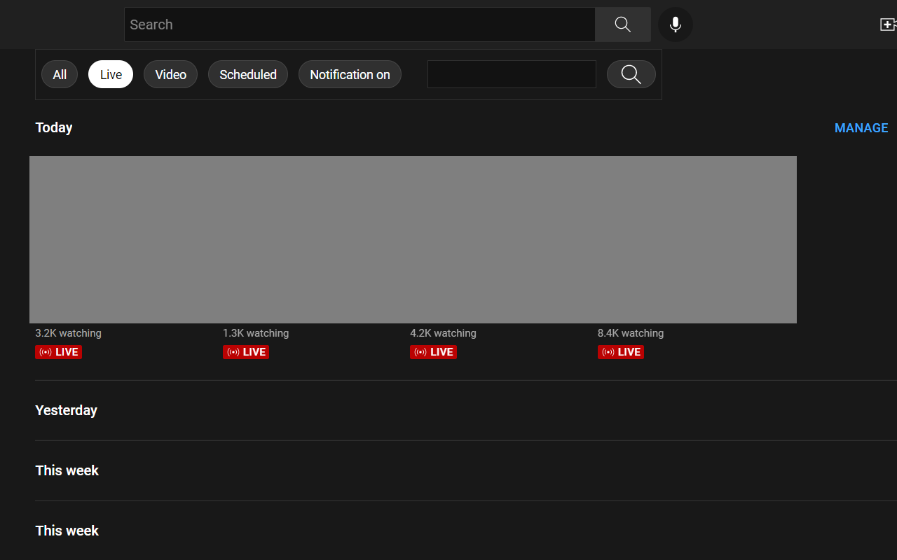

# Yudai the Tiny Developer

##  [Filter for YouTube](https://github.com/yudai-tiny-developer/filter)
YouTubeのホーム画面にあるフィルターと似たエクスペリエンスを、登録チャンネルやライブラリでも提供するChrome拡張機能

## [Auto close chat for YouTube](https://github.com/yudai-tiny-developer/auto-close-chat)
YouTubeのチャット、チャットリプレイの初期状態を非表示にするChrome拡張機能

## [Sum Time Playlist](https://github.com/yudai-tiny-developer/sum-time-playlist)
YouTubeの公開プレイリストの合計時間を計算する
