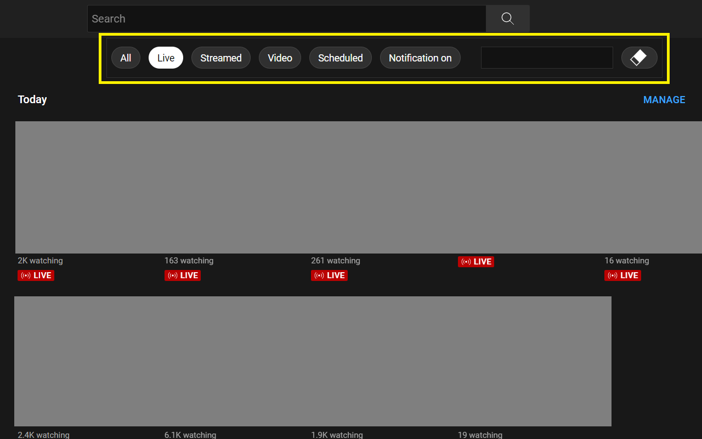

# Yudai the Tiny Developer

##  [Filter for YouTube](https://chrome.google.com/webstore/detail/filter-for-youtube/jpdngflnlekafjhdlcnijphhcmeibdoa)
* "Filter for YouTube" provides an experience similar to the filters on the YouTube home screen to subscriptions and so on.
* YouTubeのホーム画面にあるフィルターと似たエクスペリエンスを、登録チャンネルやライブラリで提供するChrome拡張機能です。
* [GitHub repository](https://github.com/yudai-tiny-developer/filter)

## Auto close chat for YouTube
* YouTubeのチャット、チャットリプレイの初期状態を非表示にするChrome拡張機能です。
* [GitHub repository](https://github.com/yudai-tiny-developer/auto-close-chat)

## [Sum Time Playlist](https://yudai-tiny-developer.github.io/sum-time-playlist/)
* YouTubeの公開プレイリストの合計時間を計算するサンプルコードです。
* [GitHub repository](https://github.com/yudai-tiny-developer/sum-time-playlist)
