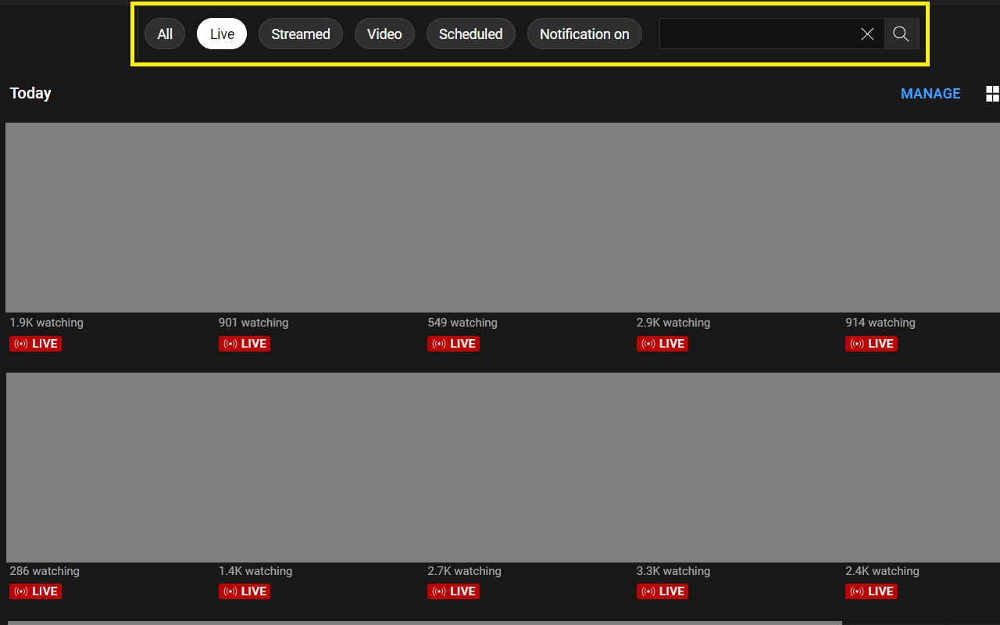
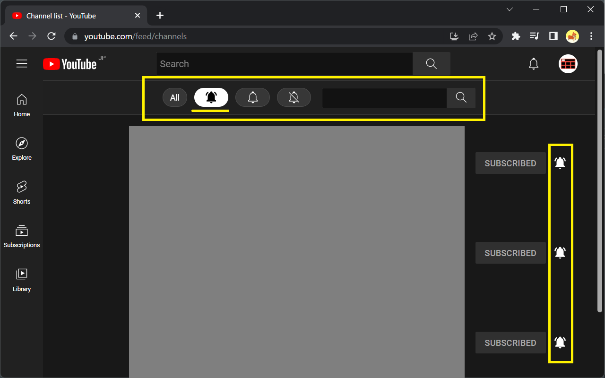

#  [Download (Chrome Web Store)](https://chrome.google.com/webstore/detail/filter-for-youtube/jpdngflnlekafjhdlcnijphhcmeibdoa)

* **[Chrome extension]** Provide an experience similar to the filters on YouTube home screen to subscriptions, library, and so on.
* **[Chrome 拡張機能]** 登録チャンネルやライブラリなどに、YouTube ホーム画面のフィルターと似たエクスペリエンスを提供します。

## 登録チャンネル、ライブラリ、再生リスト

* フィルター: ライブ, 配信済み, 動画, 予定 (公開予定とプレミア公開), 通知オン
* キーワード検索 (フィルターと併用可能)

## チャンネルリスト

* フィルター: すべて通知<svg style='width: 1em; height: 1em; fill: #6d6d6d;' viewBox='0 0 24 24' class='filter-button'><path d='M21.5 8.99992H19.5V8.80992C19.5 6.89992 18.39 5.18991 16.6 4.32991L17.47 2.52991C19.96 3.71991 21.5 6.12992 21.5 8.80992V8.99992ZM4.5 8.80992C4.5 6.89992 5.61 5.18991 7.4 4.32991L6.53 2.52991C4.04 3.71991 2.5 6.12992 2.5 8.80992V8.99992H4.5V8.80992ZM12 21.9999C13.1 21.9999 14 21.0999 14 19.9999H10C10 21.0999 10.9 21.9999 12 21.9999ZM20 17.3499V18.9999H4V17.3499L6 15.4699V10.3199C6 7.39991 7.56 5.09992 10 4.33992V3.95991C10 2.53991 11.49 1.45991 12.99 2.19991C13.64 2.51991 14 3.22991 14 3.95991V4.34991C16.44 5.09991 18 7.40991 18 10.3299V15.4799L20 17.3499Z' /></svg>, カスタマイズされた通知<svg style='width: 1em; height: 1em; fill: #6d6d6d;' viewBox='0 0 24 24' class='filter-button'><path d='M10,20h4c0,1.1-0.9,2-2,2S10,21.1,10,20z M20,17.35V19H4v-1.65l2-1.88v-5.15c0-2.92,1.56-5.22,4-5.98V3.96 c0-1.42,1.49-2.5,2.99-1.76C13.64,2.52,14,3.23,14,3.96l0,0.39c2.44,0.75,4,3.06,4,5.98v5.15L20,17.35z M19,17.77l-2-1.88v-5.47 c0-2.47-1.19-4.36-3.13-5.1c-1.26-0.53-2.64-0.5-3.84,0.03C8.15,6.11,7,7.99,7,10.42v5.47l-2,1.88V18h14V17.77z' /></svg>, 通知なし<svg style='width: 1em; height: 1em; fill: #6d6d6d;' viewBox='0 0 24 24' class='filter-button'><path d='M3.85,3.15L3.15,3.85l3.48,3.48C6.22,8.21,6,9.22,6,10.32v5.15l-2,1.88V19h14.29l1.85,1.85l0.71-0.71L3.85,3.15z M5,18 v-0.23l2-1.88v-5.47c0-0.85,0.15-1.62,0.41-2.3L17.29,18H5z M10,20h4c0,1.1-0.9,2-2,2S10,21.1,10,20z M9.28,5.75l-0.7-0.7 c0.43-0.29,0.9-0.54,1.42-0.7V3.96c0-1.42,1.49-2.5,2.99-1.76C13.64,2.52,14,3.23,14,3.96v0.39c2.44,0.75,4,3.06,4,5.98v4.14l-1-1 v-3.05c0-2.47-1.19-4.36-3.13-5.1c-1.26-0.53-2.64-0.5-3.84,0.03C9.76,5.46,9.52,5.59,9.28,5.75z' /></svg>
* キーワード検索 (フィルターと併用可能)

## Source Code
* [GitHub repository](https://github.com/yudai-tiny-developer/filter)

## テクノロジー
* YouTube Data API を使わず DOM の操作のみで機能を実現することで、高速なレスポンスを提供しています。
